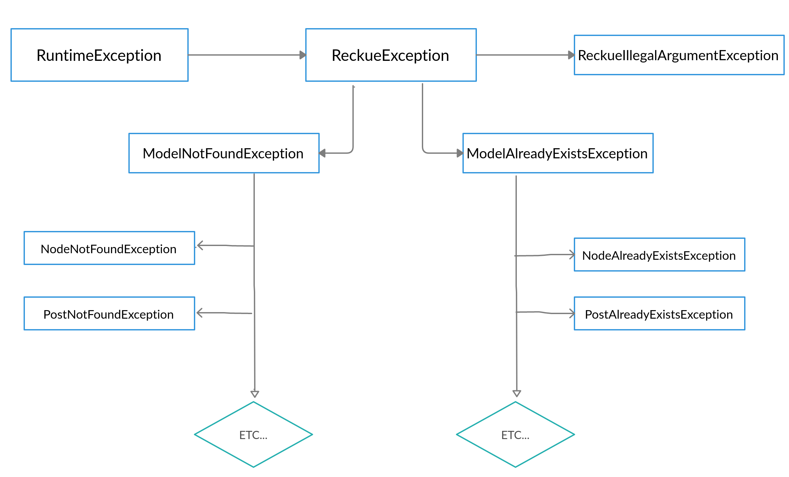

# Exceptions architecture on project

#### Exceptions hierarchy diagram based on ReckueException for all models in project

#### Each exception has fields such as title, message, trace and code. Example:

#### There is a special table for the codes:

| class | code |
|---	|---	|
| PostNotFoundException | RPE-001 |  
| NodeNotFoundException	| RPE-002 |   	
| TagNotFoundException	| RPE-003 | 
| CommentNotFoundException | RPE-004 |  
| RatingNotFoundException	| RPE-005 |   	
| PollNodeNotFoundException	| RPE-006 |
| BadRequestException	| RPE-007 |
| PostAlreadyExistsException | RPE-1001 |  
| NodeAlreadyExistsException	| RPE-1002 |   	
| TagAlreadyExistsException	| RPE-1003 |
| CommentAlreadyExistsException | RPE-1004 |  
| RatingAlreadyExistsException	| RPE-1005 |   	
| PollNodeAlreadyExistsException	| RPE-1006 |
| ReckueIllegalArgumentException | RPE-1500 |  
